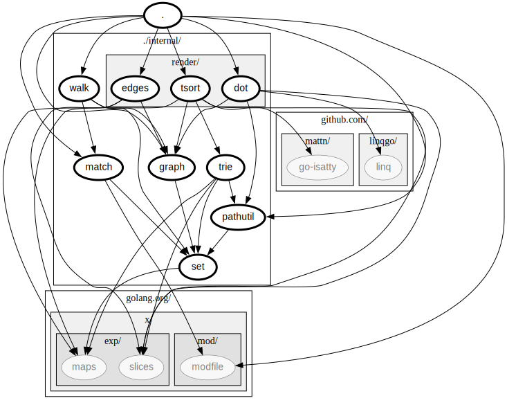
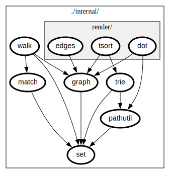

# gopkgdep

gopkgdep is a Go package dependency analysis tool. It walks the dependencies for
packages specified on the command line and outputs useful text and graphical
visualisations.

## Installation

```sh
go install github.com/goeezi/gopkgdep@latest
```

## Usage

```sh
gopkgdep -h
```

## Demos

### Text output

```sh
gopkgdep
gopkgdep -compact
gopkgdep -compact -closed
gopkgdep -compact -closed ./internal/...
```


### Graphical output

```sh
gopkgdep -dot | dot -Tsvg > out.svg
```



```sh
gopkgdep -closed -dot ./internal/... | dot -Tsvg > out.svg
```


